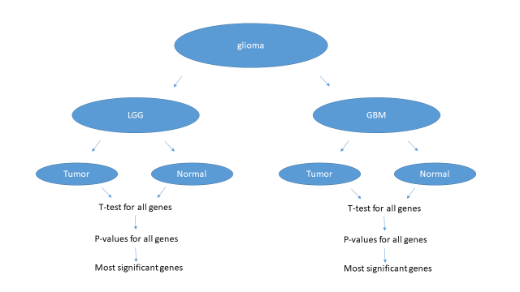
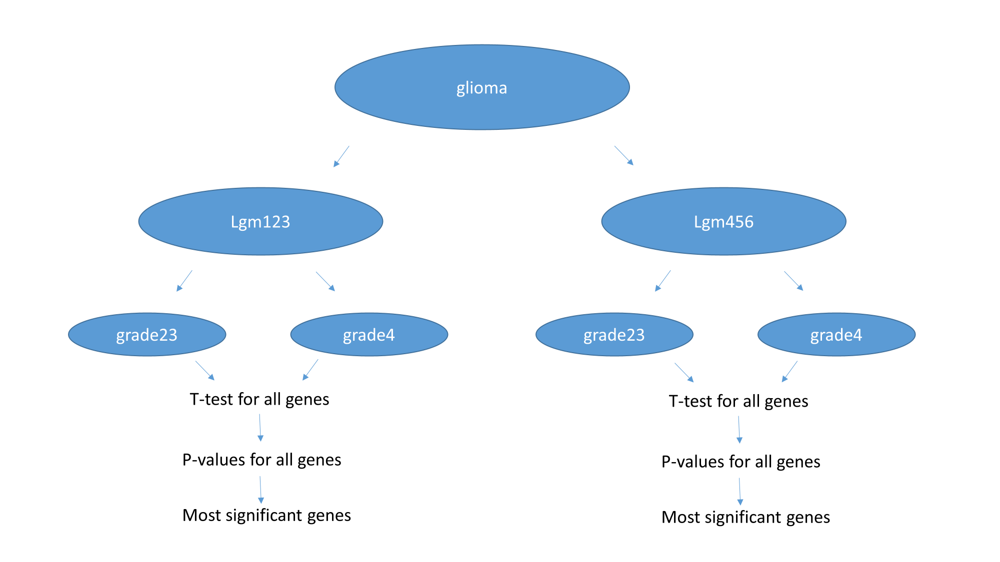
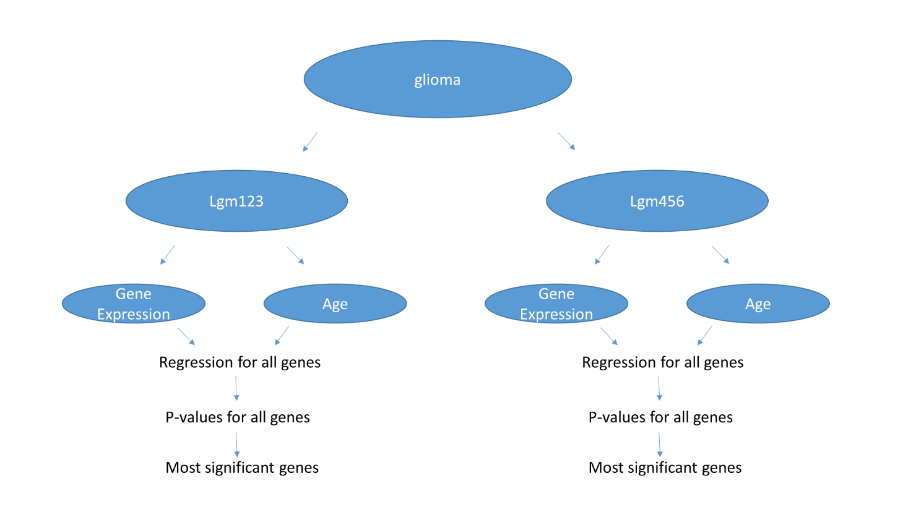
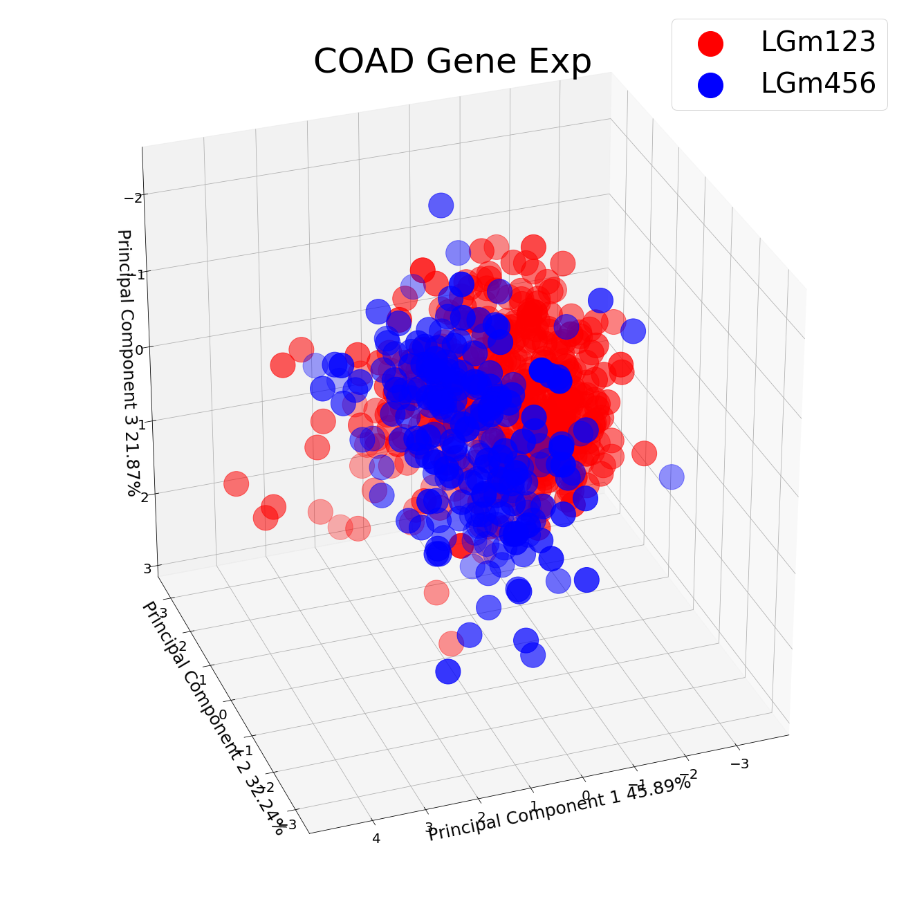
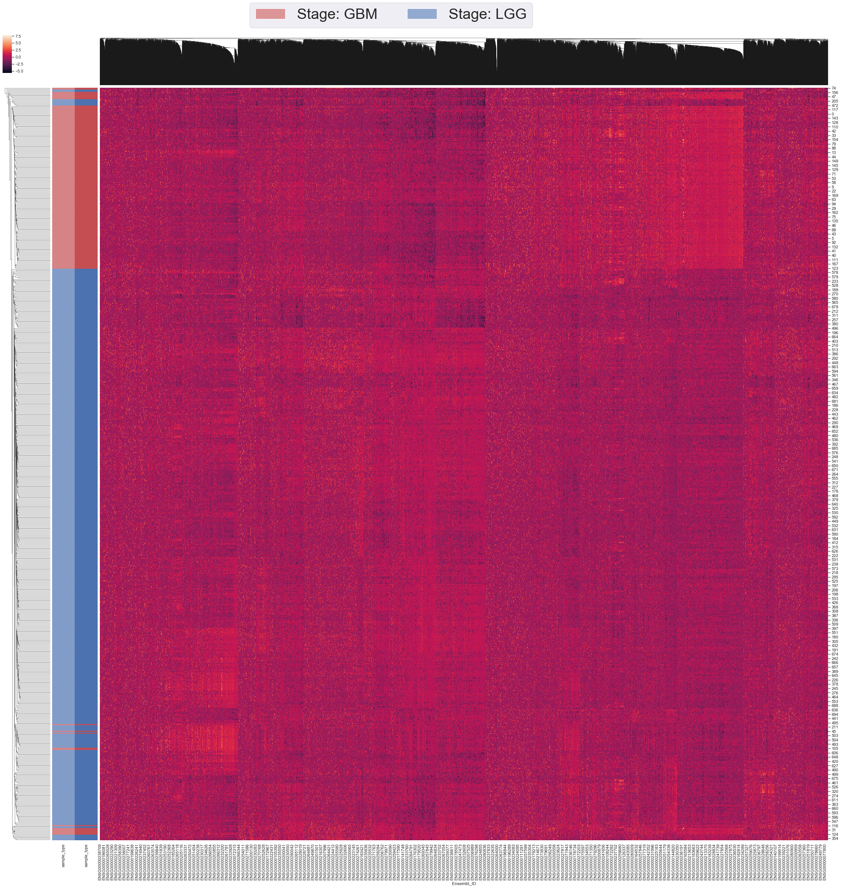

# Computational-Genomics-Data-Analaysis
Data analysis on the patients that has GBM

**Python 3 Libraries Used:**
* pandas
* numpy
* sklearn "*PCA, StandartScaler, VarianceThreshold, LinearRegression, datasets*"
* matplotlib "*plt*"
* mpl_toolkits "*Axes3D*"
* seaborn
* scipy "*stats, linregress*"
* os
* tarfile
* sys
* gzip

Patients Data:
Browse TCGA Data portal. https://portal.gdc.cancer.gov/repository

I have used GBM and LGG data sets for RNA-sequencing ( on the link above; go to Cases tab select TCGA-GBM and TCGA-LGG as projects, then go to Files tab and select RNA-seq as experimental strategy then select FKPM-UQ as workflow type). 

Following web pages will help you to understand this data set; 
https://docs.gdc.cancer.gov/Data/Bioinformatics_Pipelines/Expression_mRNA_Pipeline/
https://www.ncbi.nlm.nih.gov/pmc/articles/PMC3910500/
Inorder to understand the project having some information about the following concepts might be helpful; RNA sequencing, FKPM, t-test, p-value 

Each case(patient) is represented as a file. File names will look like;

Compressed; gdc_download_20161111_154246.tar.gz
Fully Uncompressed; 000f9b51-4747-4d7f-9ecc-25bef9b25ad7.FPKM-UQ.txt

For each gene, there should be an entry such as; ENSG00000242268.2 and a corresponding value.

I have used FileNameTCGAidTable.xlsx and converted filenames to sample IDs such as; TCGA-06-5859-01A-01R-1849-01
Then I annotated these cases for subtypes using Table S1 on http://www.cell.com/cell/fulltext/S0092-8674(15)01692-X
(Sample IDs might be annotated by using; https://docs.gdc.cancer.gov/Encyclopedia/pages/TCGA_Barcode/ as well)

All in all this project conhsists of three different section A, B and C. Each section explained seperately;

## Part A:

I have annotated samples by disease status. Both data sets have normal and tumor samples.  
For each gene I compared two groups (normal, tumor) with t-test and generated a p-value. Then I have ordered genes in increasing order of p-values and report top 20 genes I found.
Repeated the same processes for both datasets.

## Part B:

I have annotated samples by expression and methylation based clusters. Each cluster have LGG and GBM samples. I compared LGG and GBM samples within IDH-mut (LGm1-2-3) samples. Then compared LGG and GBM samples within IDH-wt (LGm4-5-6) samples.
For each gene I compared two groups with t-test and generated a p-value. Then I ordered genes in increasing order of p-values and report top 20 genes that I have found.

## Part C:

In part C I annotated samples by expression and methylation based clusters. Each cluster have LGG and GBM samples. Compared LGG and GBM samples within IDH-mut (LGm1-2-3) samples. Then used regression (https://en.wikipedia.org/wiki/Linear_regression) to find genes that correlate with Patient Age for two subtypes. 
For each gene you, I have run regression (AGE should be explanatory variable and gene should be dependent variable) and generated a p-value. Then I ordered genes in increasing order of p-values and report top 20 genes that I found. 

**After All Parts;**
I have restructured my dataframe and constructed a ***PCA*** for LGm123 and LGm456

I have also created a ***Heatmap*** with modified all data before filtering for Parts 1 and 2

